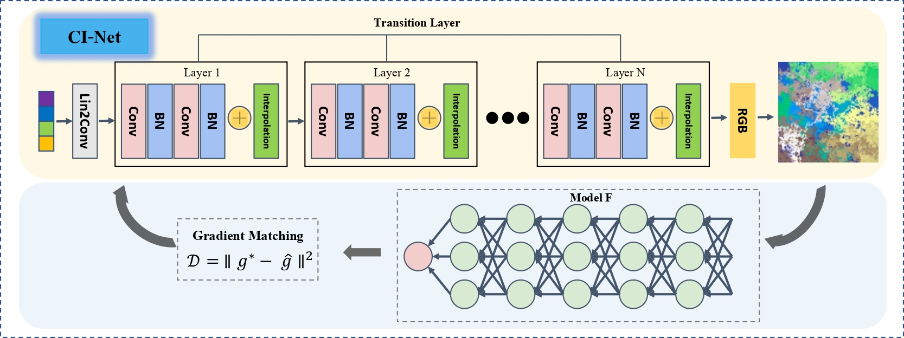
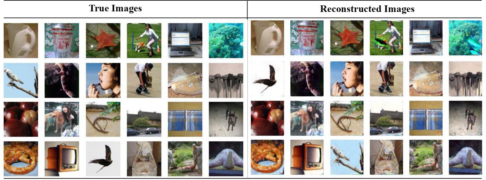

## [ICCV 2023] Generative Gradient Inversion via Over-Parameterized Networks in Federated Learning

This is a PyTorch implementation of the paper [Generative Gradient Inversion via Over-Parameterized Networks in Federated Learning](https://openaccess.thecvf.com/content/ICCV2023/papers/Zhang_Generative_Gradient_Inversion_via_Over-Parameterized_Networks_in_Federated_Learning_ICCV_2023_paper.pdf).



### Usage
#### Install
- Pytorch + torchvision + piq 
#### Training
- CIFAR10.ipynb on the CIFAR-10 (resolution: 32 x 32) dataset
- ImageNet.ipynb on the ImageNet (resolution: 256 x 256) dataset 
#### Visualization
- For each test, the SSIM value in plotted after the attacking process.
- The obtained images are also plotted after attacking for visualization.
#### Results
- Typical results are as follows.


### Citation
```python
@inproceedings{zhang2023generative,
  title={Generative Gradient Inversion via Over-Parameterized Networks in Federated Learning},
  author={Zhang, Chi and Xiaoman, Zhang and Sotthiwat, Ekanut and Xu, Yanyu and Liu, Ping and Zhen, Liangli and Liu, Yong},
  booktitle={Proceedings of the IEEE/CVF International Conference on Computer Vision},
  pages={5126--5135},
  year={2023}
}
```

### License
This project is under the MIT license. See [License](LICENSE.md) for details.
